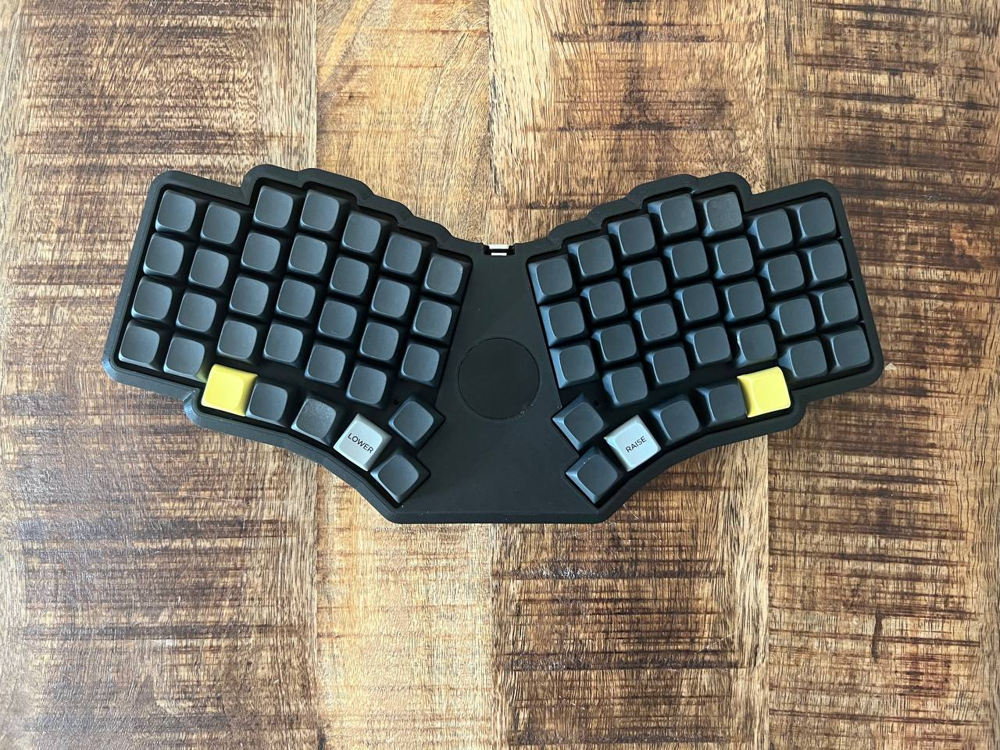

One of the greates things (maiby even the greatest thing) about mechanical keyboards that provide custom firmware support (like QMK and ZMK) is the endless support for customization. I'm still tweaking my keymaps for different keyboards but I recently starting getting in to "Combos":

> Combo keys are a way to combine multiple keypresses to output a different key. For example, you can hit the Q and W keys on your keyboard to output escape.
-- https://zmk.dev/docs/features/combos

# The problem

Having found my "ideal" number of key's being around XX keys I had some issues with finding the correct place to place the <kbd>ENTER</kbd> key. I tryed putting it on a dedicated buttont but I wanted it on my thumb cluster and I wanted it on a place where I could not press it accidantly. I tried working for a while with the <kbd>ENTER</kbd> being on a second layer but the combination of switching layer and then finding enter was to much of a hassle.

For reference, currentlly I'm using a [Fingerpunch rock on](https://fingerpunch.xyz/product-tag/rock-on/) and a [Montsinger Rebound-S](https://store.montsinger.net/products/rebound-s) with [ZMK](https://zmk.dev). I also created a combo on my [Moonlander](https://www.zsa.io/moonlander/) but to that we have to [setup a custom QMK firmware](https://github.com/zsa/qmk_firmware/).

The current physical layout I'm working with:

*Fingerpunch rock on*

# Enter combos

To get around having <kbd>ENTER</kbd> on the main layer, not pressing it on accident and having it be accessible to my thumbs I came up with the idea of using a combo (also called a chord) to trigger <kbd>ENTER</kbd>. In this way I could combo 2 keys and send the keystroke.

## Deciding on the keys

## Setting up the combo

